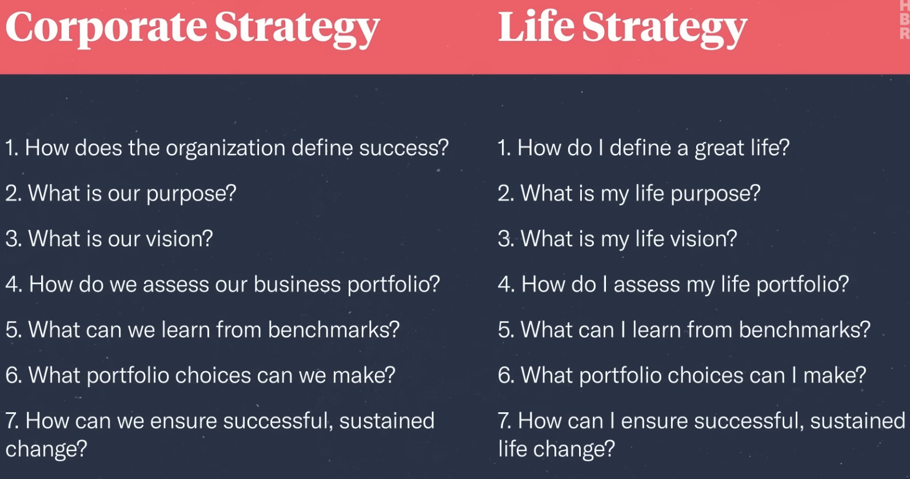
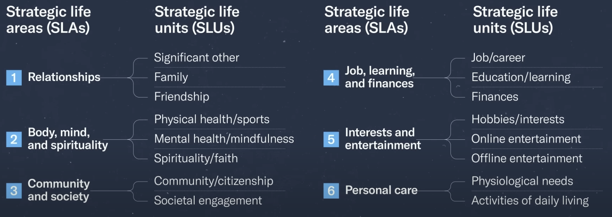
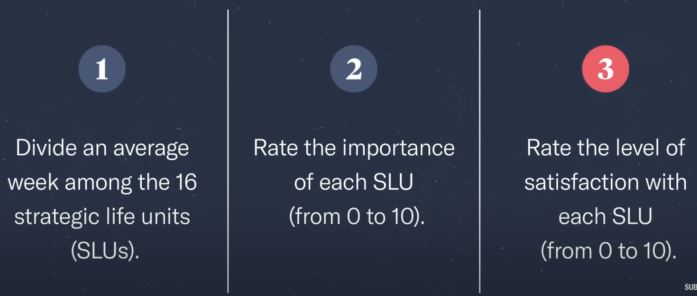
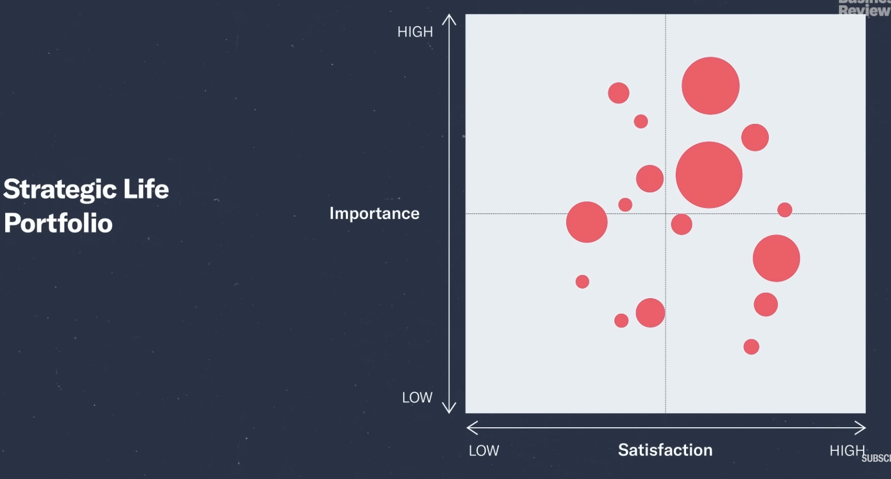
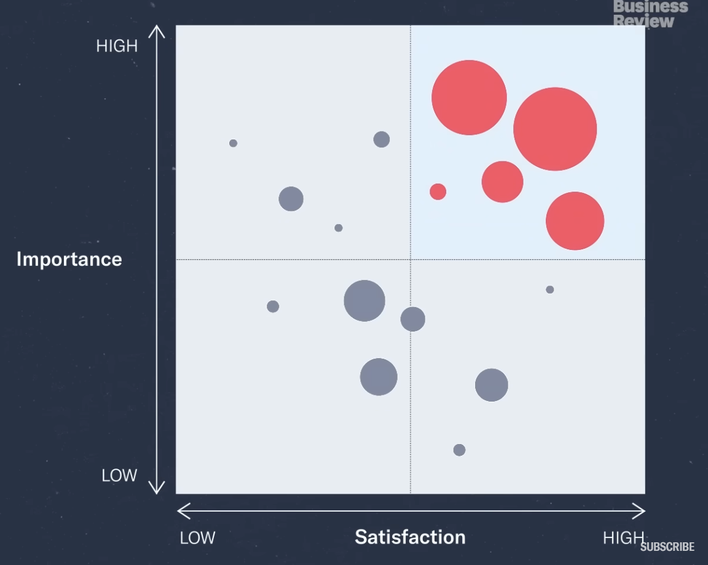

### Life Strategy
- An integrated set of choices that positions a person to live a great life.

#### Corporate Vs Life Strategy

#### Step-1: How do I define a great life
- One Framework - PERMAV
    - `P`: Positive Emotions
        - Do I have lot of contentment in my life
    - `E`: Engagement
        - Am I feeling in a flow
    - `R`: Relationships
        - deep relationships with family and other people
    - `M`: Meaning
        - making the world a better place
    - `A`: Achievement
        - Do I have lots of achievements
    - `V`: Vitality
        - Your health

#### Step-4: How do I assess my life portfolio

##### Strategic Life Areas(SLAs) Vs Strategic Life Units(SLUs)

##### Data Needed

##### Life Portfolio

##### Ideal Life Portfolio
