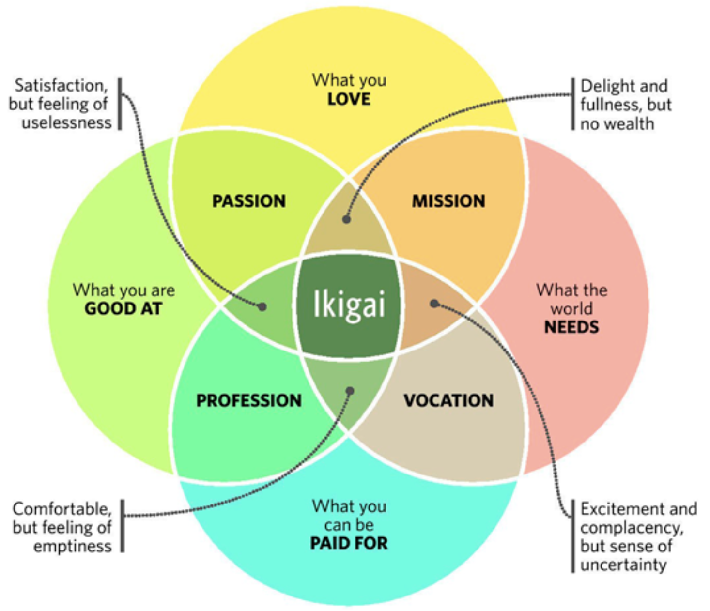

- This is in context of thinking while you are having a conversation.

- Distill the things we know down to its very essence.

- Framework-1: Ethos, Pathos & Logos
    - Credibility, Emotions & Logic

- Framework-2: Ikigai
    - Ikigai is a Japanese concept that roughly translates to "a reason for being" or "a reason to wake up in the morning."

- Find hidden frameworks on the internet
