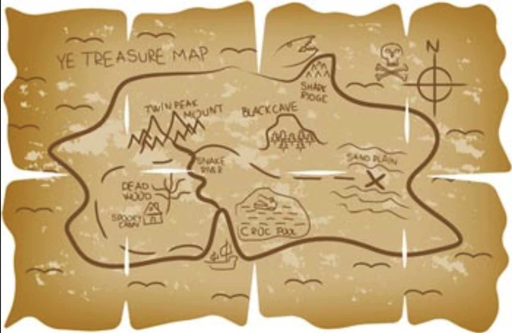

#### What is a model ?
- It is simply a low resolution representation of an actual complex situation/reality.
- We can also see it as a lens.
- The more models you have, the better your toolbox is, the less blindspots you will end up having in your world-map.

#### Model-1: The Map is not the Territory

- The representation of reality is not actual reality.

#### Model-2: Circle of Competence

- When you make a decision you can evaluate where the scope of decision lies relative to your CoC

#### Model-3: Second Order Thinking

Examples:

#### Model-4: Probabilistic Thinking

- Using some tools of math and logic, we try to estimate the likelihood of any specific outcome happening.

#### Model-5: Inversion

- You flip the situation, for ex instead of planning on how the success looks like, you start with how the failure looks like and then get details on what to avoid so as to not fail.

#### Model-6: Occam's Razor
- Simpler explanations are more likely to be true than the complicated ones.
- Make decisions based on the fewest moving parts.

#### Model-7: Hanlon's Razor
- Don't attribute to maliciousness that which is explained by incompetence.

#### Model-8: Reciprocity
- Treat someone others in a way you want to be the receiving end of the same treatment.

#### Model-9: Activation Energy
- A chemical reaction needs a certain amount of energy before it can begin working.
- One way to ease it a bit is the use of a catalyst.

Resources for more
- [blog](https://fs.blog/mental-models/)
- [book](https://fs.blog/books/)